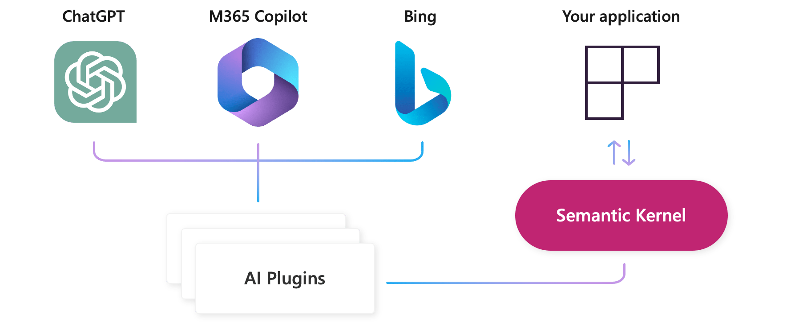

# **第三章：开启大模型的技能之门 - Plugins**

在上一章，我们了解了 Semantic Kernel 的基本知识。其中 Semantic Kernel 的一大特点是拥有强大的插件，通过结合自定义/预定义的插件解决智能业务的问题。让传统的代码和智能插件一起工作灵活地接入到应用场景简化传统应用向智能化转型的过程。 本章，我们主要介绍如何使用插件。

## **什么是插件**



我们知道 LLMs 本来的数据是有时间限制的，如果要增加实时内容或者企业化的知识是有相当大的缺陷。OpenAI 通过插件将 ChatGPT 连接到第三方应用程序。 这些插件使 ChatGPT 能够与开发人员定义的 API 进行交互，从而增强 ChatGPT 的功能并允许有更广泛的操作，如：

1. 检索实时信息，例如，体育赛事比分、股票价格、最新新闻等。

2. 检索知识库信息， 例如，公司文档、个人笔记等。

3. 协助用户进行相关操作，例如，预订航班、订餐等。

Semantic Kernel 遵循 OpenAI 的插件的插件规范，可以很方便地接入和导出插件(如基于 Bing, Microsoft 365, OpenAI 的插件)，这样可以让开发人员很简单地调用不同的插件服务。除了兼容 OpenAI 的插件外，Semantic Kernel 内也有属于自己插件定义的方式。不仅可以在规定模版格式上定义 Plugins, 更可以在函数内定义 Plugins.

### **认知 Plugins**

在早期的 Semantic Kernel 预览版本中，Plugins 并定义为 Skills。正如上面提及的，和 OpenAI 看齐。但具体的目标没有变化。你可以理解 Semantic Kernel 的插件就是给开发人员通过完成智能业务需求的各种功能。你可以把 Semantic Kernel 看成是乐高的底座，要完成一个长城的堆砌就需要有各种不同的功能模块。而这些功能模块就是我们所说的插件。

我们可能有基于业务的插件集，如 HRPlugins 下就包含了不同的功能，如：


| 插件  | Intro |
|----------|:----------|
| Holidays  | 关于假期内容的插件 |
| Contracts  | 关于员工合同 |
| Departments  | 关于组织结构相关的 |

这些子功能可以根据不同的要求进行有效组合来完成不同的计划任务。 例如以下结构：


```txt

|-plugins
    |-HRPlugins
        |-Holidays
        |-Contract
        |-Departments
    |-EmailsPlugins
        |-HRMail
        |-CustomMail
    |-PeoplesPlugins
        |-Managers
        |-Workers

```

我们向大模型发出一条指令“请向合同到期的管理人员，发送一个 Email”，实际就是从不同的组件找组合，最后就是依据 Contract + Managers + HRMail 来完成相关的工作


## **Semantic Kernel 插件**


### **通过模版定义插件**

我们知道通过提示工程可以和 LLMs 进行对话。对于一个企业或者创业公司，我们在处理业务时，可能不是一个提示工程，可能需要有针对提示工程的合集。我们可以把这些针对业务能力的提示工程集放到 Semantic Kernel 的插件集合内。对于结合提示工程的插件，Semantic Kernel 有固定的模版，提示工程都放在 skprompt.txt 文件内，而相关参数设置都放在 config.json 文件内。最后的文件结构式这样的


```txt

|-plugins
    |-HRPlugins
        |-Holidays
            |-skprompt.txt
            |-config.json
        |-Contract
            |-skprompt.txt
            |-config.json
        |-Departments
            |-skprompt.txt
            |-config.json
    |-EmailsPlugins
        |-HRMail
            |-skprompt.txt
            |-config.json
        |-CustomMail
            |-skprompt.txt
            |-config.json
    |-PeoplesPlugins
        |-Managers
            |-skprompt.txt
            |-config.json
        |-Workers
            |-skprompt.txt
            |-config.json

```

我们先来看看 **skprompt.txt** 的定义，这里一般是放置和业务相关的 prompt，可以支持多个参数，每个参数都放置在 {{$参数名}} 内，如以下格式：


```txt

Translate {{$input}} into {{$language}}


```

我们这里的工作是把输入内容翻译成特定的语言，input 和 language 是两个参数，也就是说你可以给这两个参数给出随意的值。

在 **config.json** 中就是配置相关的内容，随了设置和 LLMs 相关的参数外，你也可以设定输入的参数以及相关描述

```json

{
    "schema": 1,
    "description": "Translate sentenses into a language of your choice",
    "execution_settings": {
        "default": {
            "max_tokens": 2000,
            "temperature": 0.7,
            "top_p": 0.0,
            "presence_penalty": 0.0,
            "frequency_penalty": 0.0,
            "stop_sequences": [
              "[done]"
            ]
        }
    },
    "input_variables": [
        {
          "name": "input",
          "description": "sentense to translate",
          "default": ""
        },
         {
          "name": "language",
          "description": "Language to translate to",
          "default": ""
        }
    ]
}

```


### **通过函数定义插件**

我们也可以通过函数定义不同的插件，这个有点像 gpt-3.5-turbo 在 6 月 13 日 发布的 Function Calling ，这是通过增加外部函数，通过调用来增强 OpenAI 模型的能力。正如本章开篇时所提及的。

#### **Function Calling**

通过描述式的函数， LLMs 调用这些函数的参数的 JSON 对象。 这是一种 GPT 功能与外部工具和 API 连接起来的方法。支持 Azure OpenAI Service 或 OpenAI 上 的：

- gpt-4
- gpt-4-1106-preview
- gpt-4-0613
- gpt-3.5-turbo
- gpt-3.5-turbo-1106
- gpt-3.5-turbo-0613

Semantic Kernel 也支持 Function Calling 的方式调用，但一般很少采用，除非你本来有为业务定制好的 Function Calling 方法


#### **Semantic Kernel 定义函数插件**

Semantic Kernel 定义函数插件，比起用 Function Calling 更为简单，而且在 Function Calling 诞生之前就有了相关的定义方法，不受模型限制，你可以在早期模型中就用上这种方式对 LLMs 进行知识和数据扩充。所有的自定义函数建议放置在 plugins 的同一文件夹下方便管理。

**.NET 应用场景**

定义函数扩展，需要加上宏定义

```csharp

[KernelFunction,Description("search weather")]
public string WeatherSearch(string text)
{
    return "Guangzhou, 2 degree,rainy";
}

```

***注意：*** 建议用业务类封装的方式定义好不同的扩展函数，方便调用时更加简单，如


```csharp

using Microsoft.SemanticKernel;
using System.ComponentModel;
using System.Globalization;


public class CompanySearchPlugin
{
    [KernelFunction,Description("search employee infomation")]
    public string EmployeeSearch(string input)
    {
        return "欢迎了解社保相关内容";
    }

    [KernelFunction,Description("search weather")]
    public string WeatherSearch(string text)
    {
        return "Guangzhou, 2 degree,rainy";
    }
}

```

调用方法如下：


```csharp

var companySearchPluginObj = new CompanySearchPlugin();

var companySearchPlugin = kernel.ImportPluginFromObject(companySearchPluginObj, "CompanySearchPlugin");

var weatherContent = await kernel.InvokeAsync( companySearchPlugin["WeatherSearch"],new(){["text"] = "广州天气"});

weatherContent.GetValue<string>()


```

**Python 应用场景**


定义函数扩展，需要加上宏定义

```python

@kernel_function_context_parameter(name="city", description="city string")
def ask_weather_function(self, context: KernelContext) -> str:
    return context["city"] + "’s weather is 30 celsius degree , and very hot."

```

把自定义函数都放置在 **native_function.py** 中，并通过类来定义，如


```python

from semantic_kernel import SKContext
from semantic_kernel.plugin_definition import kernel_function,kernel_function_context_parameter


class CustomPlugin:
    @kernel_function(
        description = "Get news from the web",
        name = "NewsPlugin"
    )
    @kernel_function_context_parameter(name="location", description="location name")
    def get_news_api(self, context: SKContext) -> str:
        return """Get news from the """ + context["location"] + """."""
    
    @kernel_function(
            description="Search Weather in a city",
            name="WeatherFunction"
        )
    @kernel_function_context_parameter(name="city", description="city string")
    def ask_weather_function(self, context: SKContext) -> str:
        return "Guangzhou’s weather is 30 celsius degree , and very hot."
    
    @kernel_function(
            description="Search Docs",
            name="DocsFunction" 
        )
    @kernel_function_context_parameter(name="docs", description="docs string")
    def ask_docs_function(self, context: SKContext) -> str:
        return "ask docs :" + context["docs"]

```

调用方法如下：


```python

import APIPlugin.CustomPlugin as custom_plugin

api_plugin = kernel.import_plugin(custom_plugin.CustomPlugin(), plugin_name="CustomPlugin")  

context_variables = sk.ContextVariables(variables={"city": "Guangzhou"})

news_result = await api_plugin["WeatherFunction"].invoke(variables=context_variables)

print(news_result)

```


### **内置插件**

Semantic Kernel 有非常多的预定义插件，作为解决一般业务的相关能力，当然随着 Semantic Kernel 的成熟，会有更多的内置插件融入进来。

## **例子**

***.NET 例子*** 请[点击访问这里](https://github.com/microsoft/SemanticKernelCookBook/blob/main/notebooks/dotNET/03/PluginWithSK.ipynb)

***Python 例子*** 请[点击访问这里](https://github.com/microsoft/SemanticKernelCookBook/blob/main/notebooks/python/03/FunctionCallWithSK.ipynb)


## **小结**

通过插件你可以基于业务场景完成更多的工作，通过本章的学习，你已经初步掌握插件的定义以及如何使用插件进行工作。希望你在真正的业务工作中，基于业务场景，打造属于企业的插件库


