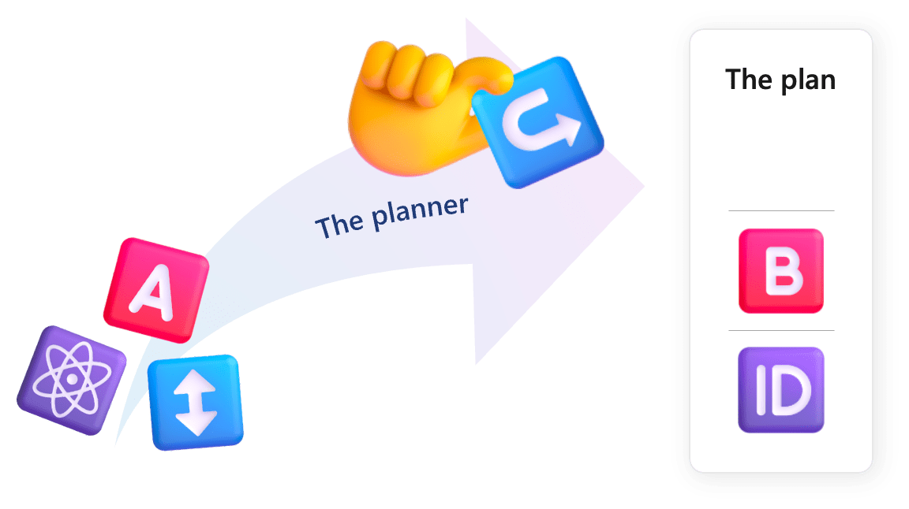

# **Planner - Let LLM have planning work**

In Last Chapter, we learned a very important function of Semantic Kernel - plug-ins, through which work in different fields can be completed. LLMs change the way human-computer interaction uses natural language to talk to LLMs and let the LLMs complete the work. But often the instructions we give are not just about completing a single task, such as "Please send a dressing reminder email to people on business trips based on the weather in Seattle." We have always wanted artificial intelligence to compare with humans. If we think about the above instructions using human thinking, we will have the following split:

1. Check the weather in Seattle

2. Query the business travelers and their contact information from the company system

3. Reminder email template

4. Send email

LLMs actually have the same thinking. There is a powerful Planner function in the Semantic Kernel to split tasks. This chapter will tell you the relevant content.

## **What's Planner**

Planner is an important component of the Semantic Kernel. It can receive task instructions and then correspond to the built-in plug-ins or custom plug-ins that have been defined in the Kernel, so that the task instructions can work step by step. As mentioned at the beginning, in fact, for the instruction "please send a dressing reminder email to business people based on the weather in Seattle", the relevant plugins will be defined in plugins and registered through Kernel, Semantic Kernel will Assist you with the pairing steps.



## **How to use Planner**

Now Planner is still in the evolutionary stage. In the latest .NET version, we found that the Semantic Kernel version of the Planner component Microsoft.SemanticKernel.Planners.Handlebars is different from the core Microsoft.SemanticKernel. Some users are questioning whether the Semantic Kernel version number is confusing. You can understand that the Semantic Kernel team has completed the core part in 2023, and component-based functions such as Planner, Memory, and some Connectors are still evolving. After all, these features are relevant to the development of LLMs.

If you need to use Planner, you need to consider your business scenario. For example, adding Planner to some business processes and adding Planner to tool chains are very useful. After all, humans think a lot about work automation.

**.NET** 

add related component libraries about Planner

```csharp

#r "nuget: Microsoft.SemanticKernel.Planners.Handlebars, *-*"

```

import library


```csharp

using Microsoft.SemanticKernel.Planning;

```

***Note:*** When using HanlerBars, you need to note that these features are still evolving, and please ignore SKEXP0060 when using them.


```csharp

#pragma warning disable SKEXP0060

```


**Python**


import library

```python

from semantic_kernel.planning.basic_planner import BasicPlanner

```

or


```python

from semantic_kernel.planning.sequential_planner import SequentialPlanner


```

***Note:*** The settings of Python's Planner and .NET's Planner are different here. Python should be synchronized with .NET, so when using Python, you need to be prepared for future changes.


### **The Changing Planner**

In the official blog, changes in Planner are mentioned https://devblogs.microsoft.com/semantic-kernel/migrating-from-the-sequential-and-stepwise-planners-to-the-new-handlebars-and -stepwise-planner/ combines Function Calling to rearrange the different Planner integrations in the preview version. You can pay attention to this content to learn more.

If you want to understand the principles of Planner implementation, please refer to

https://github.com/microsoft/semantic-kernel/blob/main/dotnet/src/Planners/Planners.Handlebars/Handlebars/CreatePlanPrompt.handlebars

## **Sample**

***.NET Sample*** Please [click here](https://github.com/microsoft/SemanticKernelCookBook/blob/main/notebooks/dotNET/04/PlannerWithSK.ipynb)

***Python Sample*** Please [click here](https://github.com/microsoft/SemanticKernelCookBook/blob/main/notebooks/python/04/PlannerWithSK.ipynb)


## **Summary**

The addition of Planner greatly improves the usability of Semantic Kernel, especially for business and tool scenarios. Building an enterprise-level plugin library is also very important for the implementation of Planner. After all, we use plug-ins to combine different tasks to complete the work.

